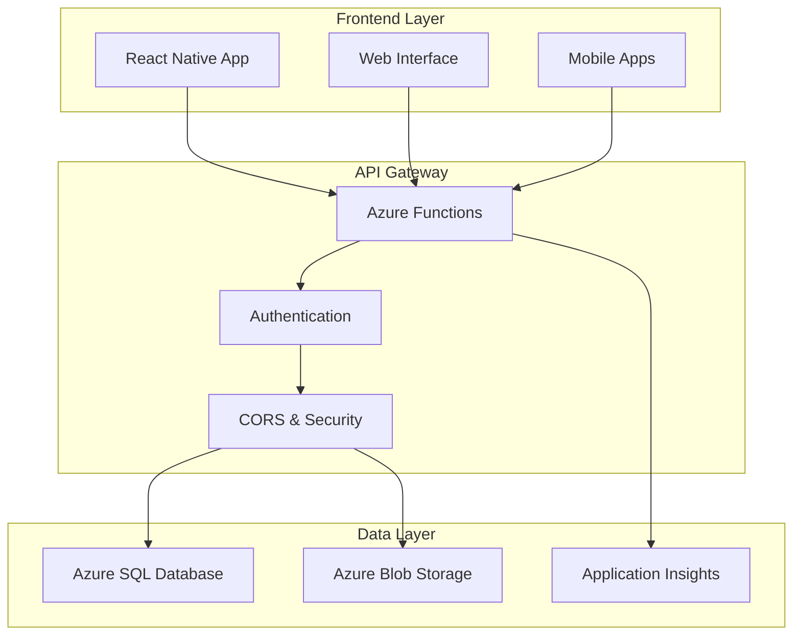

# 🚀 NexHire - Modern Job Platform

> **A comprehensive, production-ready job platform built with cutting-edge technology and designed for scale.**

[](https://www.typescriptlang.org/)
[](https://reactnative.dev/)
[](https://azure.microsoft.com/en-us/services/functions/)
[](https://azure.microsoft.com/en-us/products/azure-sql/)

## 📋 Table of Contents

- [🎯 Project Overview](#-project-overview)
- [✨ Key Features](#-key-features)
- [🏗️ Architecture](#️-architecture)
- [🛠️ Technology Stack](#️-technology-stack)
- [📱 Frontend Features](#-frontend-features)
- [🔧 Backend Services](#-backend-services)
- [🗄️ Database Schema](#️-database-schema)
- [🚀 Quick Start](#-quick-start)
- [📦 Deployment](#-deployment)
- [🧪 Testing](#-testing)
- [📚 API Documentation](#-api-documentation)
- [🔒 Security Features](#-security-features)
- [🎨 UI/UX Highlights](#-uiux-highlights)
- [🤝 Contributing](#-contributing)

## 🎯 Project Overview

**NexHire** is a modern, full-stack job platform that connects job seekers with employers through an intuitive, feature-rich interface. Built with serverless architecture on Azure, it offers scalability, performance, and cost-effectiveness.

### 🌟 What Makes NexHire Special

- **🔄 Universal Cross-Platform**: Single React Native codebase for Web, iOS, and Android
- **⚡ Serverless Backend**: Azure Functions with auto-scaling and pay-per-use pricing
- **🧠 Smart Profile System**: AI-driven profile completeness and intelligent field routing
- **💰 Advanced Salary Management**: Component-based salary breakdown with multi-currency support
- **🔐 Enterprise Security**: JWT authentication, encrypted storage, and comprehensive validation
- **📊 Real-time Analytics**: Built-in dashboard with application tracking and insights

## ✨ Key Features

### 👥 **Multi-User Type Support**
- **Job Seekers**: Complete profile management with education, experience, and preferences
- **Employers**: Organization management, job posting, and candidate tracking
- **Role-based Permissions**: Tailored experiences based on user type

### 📝 **Intelligent Registration Flows**
- **Student Path**: Education-focused onboarding with internship preferences
- **Professional Path**: Comprehensive work experience and skills assessment
- **Employer Onboarding**: Organization setup with recruitment permissions

### 💼 **Advanced Profile Management**
- **Smart Profile Completion**: Dynamic progress tracking with field-specific guidance
- **Privacy Controls**: Granular settings for company visibility and salary disclosure
- **Cross-Platform Image Upload**: Seamless profile picture management across all devices
- **Real-time Validation**: Instant feedback with intelligent error handling

### 💸 **Comprehensive Salary System**
- **Component Breakdown**: Fixed, Variable, Bonus, and Equity tracking
- **Multi-Currency Support**: INR default with international currency options
- **Privacy Settings**: Configurable salary visibility for recruiters
- **Current vs Expected**: Separate tracking for current and desired compensation

### 🔍 **Job Management & Search**
- **Advanced Filtering**: Location, experience, salary, and work type filters
- **Smart Matching**: AI-powered job recommendations based on profile data
- **Application Tracking**: Complete workflow from application to hire
- **Real-time Notifications**: Instant updates on application status

## 🏗️ Architecture



### 🏛️ **Serverless Architecture Benefits**

- **💰 Cost Optimization**: Pay only for actual usage with Azure Functions consumption plan
- **📈 Auto-Scaling**: Automatic scale-up/down based on demand
- **🌍 Global Distribution**: Azure CDN for worldwide performance
- **🔄 Zero Maintenance**: Managed infrastructure with automatic updates
- **📊 Built-in Monitoring**: Comprehensive telemetry with Application Insights

## 🛠️ Technology Stack

### **Frontend Stack**
| Technology | Purpose | Benefits |
|------------|---------|----------|
| **React Native + Expo** | Cross-platform development | Single codebase for Web/iOS/Android |
| **TypeScript** | Type safety | Better development experience, fewer bugs |
| **React Navigation** | Routing & navigation | Native navigation performance |
| **Context API** | State management | Lightweight, built-in state solution |
| **AsyncStorage/SecureStore** | Local persistence | Platform-optimized data storage |

### **Backend Stack**
| Technology | Purpose | Benefits |
|------------|---------|----------|
| **Azure Functions v4** | Serverless APIs | Auto-scaling, cost-effective |
| **Node.js 20+** | Runtime environment | Latest features, performance |
| **TypeScript** | Backend type safety | Consistent types across stack |
| **Joi Validation** | Input validation | Robust data validation |
| **JWT + Refresh Tokens** | Authentication | Secure, stateless auth |

### **Data & Storage**
| Service | Purpose | Configuration |
|---------|---------|---------------|
| **Azure SQL Database** | Primary database | Basic tier, auto-scaling enabled |
| **Azure Blob Storage** | File storage | Standard LRS for cost optimization |
| **Application Insights** | Monitoring & analytics | Real-time performance tracking |
| **Azure Static Web Apps** | Frontend hosting | Global CDN, automatic deployment |

## 📱 Frontend Features

### 🎨 **Modern UI/UX Design**
- **Material Design Principles**: Consistent, intuitive interface
- **Dark/Light Theme Support**: User preference-based theming
- **Responsive Layout**: Optimized for all screen sizes
- **Accessibility**: WCAG 2.1 AA compliance
- **Smooth Animations**: 60fps performance with React Native Reanimated

### 📋 **Profile Management Screens**
```typescript
// Comprehensive profile sections
ProfileSections = {
  education: "EducationSection",           // Institution, degree, GPA tracking
  professional: "ProfessionalSection",    // Work experience, skills
  preferences: "PreferencesSection",      // Job preferences, location
  salary: "SalaryBreakdownSection",       // Advanced salary management
  privacy: "PrivacySettingsSection",      // Granular privacy controls
  documents: "DocumentsSection"           // Resume, portfolio uploads
}
```

### 🔄 **Smart Registration Flows**
- **Conditional Logic**: Different paths for students vs professionals
- **Progress Tracking**: Visual completion indicators
- **Real-time Validation**: Instant feedback on form inputs
- **Auto-save**: Prevents data loss during registration

## 🔧 Backend Services

### 📡 **API Architecture (31 Endpoints)**

#### **Authentication Services**
```typescript
POST   /auth/register          // Multi-type user registration
POST   /auth/login             // JWT token generation
POST   /auth/logout            // Secure token invalidation
POST   /auth/refresh           // Token refresh handling
```

#### **Profile Management**
```typescript
// Basic Profile
GET    /users/profile          // Retrieve user profile
PUT    /users/profile          // Update basic information
POST   /users/profile-image    // Cross-platform image upload

// Extended Profiles
GET    /applicants/{id}/profile    // Job seeker extended profile
PUT    /applicants/{id}/profile    // Update job seeker profile
GET    /employers/{id}/profile     // Employer extended profile
PUT    /employers/{id}/profile     // Update employer profile

// Specialized Updates
PUT    /users/education            // Education-specific updates
PUT    /users/work-experience      // Work experience updates
PUT    /users/job-preferences      // Job preference updates
```

#### **Job & Application System**
```typescript
// Job Management
GET    /jobs                   // List jobs with filtering
POST   /jobs                   // Create new job posting
GET    /jobs/{id}              // Job details
PUT    /jobs/{id}              // Update job posting
DELETE /jobs/{id}              // Remove job posting
POST   /jobs/{id}/publish      // Publish job
POST   /jobs/{id}/close        // Close job to applications

// Application Workflow
POST   /applications           // Submit job application
GET    /applications/my        // User's applications
GET    /applications/stats     // Application analytics
PUT    /applications/{id}/status // Update application status
```

### 🔒 **Security Implementation**

#### **Authentication & Authorization**
- **JWT Tokens**: Short-lived access tokens with refresh mechanism
- **Password Security**: bcrypt hashing with salt rounds
- **Rate Limiting**: API endpoint protection against abuse
- **CORS Configuration**: Cross-origin resource sharing setup
- **Input Validation**: Comprehensive Joi schema validation

#### **Data Protection**
- **SQL Injection Prevention**: Parameterized queries throughout
- **XSS Protection**: Input sanitization and output encoding
- **Secure Headers**: HTTPS enforcement, security headers
- **File Upload Security**: Type validation, size limits, virus scanning

## 🗄️ Database Schema

### **Core Tables Structure**

```sql
-- User Management
Users                    // Basic user information and authentication
├── UserID (Primary Key)
├── Email (Unique)
├── Password (Hashed)
├── UserType (JobSeeker|Employer|Admin)
├── FirstName, LastName
├── Phone, DateOfBirth, Gender
└── Security & Status fields

-- Extended Profiles
Applicants              // Job seeker extended profiles
├── ApplicantID (Primary Key)
├── UserID (Foreign Key → Users)
├── Education fields (Institution, Degree, GPA, etc.)
├── Professional fields (JobTitle, Company, Experience, etc.)
├── Skills (Primary, Secondary, Languages, Certifications)
├── Preferences (JobTypes, WorkTypes, Locations, Salary)
├── Privacy settings (HideCompany, HideSalary, etc.)
└── Profile metadata (Completeness, Status, etc.)

Employers               // Employer profiles
├── EmployerID (Primary Key)
├── UserID (Foreign Key → Users)
├── OrganizationID (Foreign Key → Organizations)
└── Permissions (CanPost, CanManage, CanView, etc.)

-- Organization Management
Organizations           // Company information
├── OrganizationID (Primary Key)
├── Name, Description, Industry
├── Size, Location, Website
├── Verification status
└── Metadata

-- Job System
Jobs                    // Job postings
├── JobID (Primary Key)
├── OrganizationID (Foreign Key)
├── PostedByUserID (Foreign Key → Users)
├── Job details (Title, Description, Requirements, etc.)
├── Compensation (SalaryMin, SalaryMax, Currency, etc.)
├── Location & Remote options
├── Status and visibility
└── Application management

JobApplications         // Application tracking
├── ApplicationID (Primary Key)
├── JobID (Foreign Key → Jobs)
├── ApplicantID (Foreign Key → Applicants)
├── Application details (Resume, CoverLetter, etc.)
├── Status tracking
└── Timestamps

-- Reference Data
JobTypes               // Employment types (Full-time, Contract, etc.)
Currencies            // Multi-currency support
ApplicationStatuses   // Application workflow states
SalaryComponents      // Salary breakdown structure
```

### **Advanced Features**
- **Profile Completeness Calculation**: Dynamic scoring based on filled fields
- **Smart Field Routing**: Automatic API endpoint selection based on field types
- **Salary Breakdown System**: Component-based compensation tracking
- **Privacy Controls**: Granular visibility settings for sensitive information

## 🚀 Quick Start

### **Prerequisites**
```bash
# Required software
Node.js 20+             # JavaScript runtime
Azure CLI               # Azure resource management
PowerShell 7+           # Deployment scripts
Git                     # Version control

# Development tools
Visual Studio Code      # Recommended IDE
Azure Functions Core Tools v4  # Local development
```

### **1. Clone Repository**
```bash
git clone https://github.com/RichardHenryJames/nexhire.git
cd nexhire
```

### **2. Backend Setup**
```bash
# Install dependencies
npm install

# Build TypeScript
npm run build

# Start local development server
npm start
```

### **3. Frontend Setup**
```bash
cd frontend

# Install dependencies
npm install

# Start development server
npm start

# For specific platforms
npm run web      # Web development
npm run android  # Android development
npm run ios      # iOS development
```

### **4. Database Setup**
```powershell
# Configure database connection
$connectionString = "Server=nexhire-sql-srv.database.windows.net;Database=nexhire-sql-db;..."

# Deploy database schema
Invoke-Sqlcmd -ConnectionString $connectionString -InputFile "deploy_database.sql"

# Verify deployment
Invoke-Sqlcmd -ConnectionString $connectionString -Query "SELECT COUNT(*) FROM Users"
```

## 📦 Deployment

### **Automated Deployment**
```powershell
# Complete infrastructure deployment
.\deploy-backend.ps1

# Deploy with monitoring
.\deploy-with-monitoring.ps1

# Quick deployment (code changes only)
.\quick-deploy.ps1
```

### **Azure Resources Created**
```yaml
Resource Group: nexhire-dev-rg
├── Function App: nexhire-api-func
│   ├── Runtime: Node.js 20
│   ├── Plan: Consumption (Y1)
│   └── Functions: 31 HTTP triggers
├── SQL Database: nexhire-sql-db
│   ├── Server: nexhire-sql-srv
│   ├── Tier: Basic (Upgradable)
│   └── Firewall: Configured
├── Storage Accounts:
│   ├── nexhirefuncdevst (Function storage)
│   └── nexhireblobdev (File storage)
├── Static Web App: nexhire-frontend-web
│   ├── Tier: Free
│   ├── CDN: Enabled
│   └── Custom domains: Supported
└── Application Insights: nexhire-monitor
    ├── Performance monitoring
    ├── Error tracking
    └── Custom analytics
```

### **Production Configuration**
```typescript
// Environment variables
const config = {
  DATABASE_CONNECTION: process.env.SQLAZURECONNSTR_DefaultConnection,
  JWT_SECRET: process.env.JWT_SECRET,
  BLOB_STORAGE_CONNECTION: process.env.AzureWebJobsStorage,
  CORS_ORIGINS: process.env.CORS_ALLOWED_ORIGINS,
  ENVIRONMENT: process.env.AZURE_FUNCTIONS_ENVIRONMENT
};
```

## 🧪 Testing

### **Comprehensive Test Suite**
```bash
# Run all tests
npm test

# Specific test suites
npm run test:registration-only      # Registration flow tests
npm run test:profile-update         # Profile update tests
npm run test:api-integration        # API integration tests
npm run test:all-flows             # Complete user flow tests

# Coverage reports
npm run test:coverage

# CI/CD tests
npm run test:ci
```

### **Test Categories**

#### **Unit Tests**
- ✅ Authentication flow validation
- ✅ Profile update routing logic
- ✅ Salary breakdown calculations
- ✅ Data validation schemas
- ✅ Security middleware

#### **Integration Tests**
- ✅ Complete registration flows (Student vs Professional)
- ✅ API endpoint responses
- ✅ Database schema validation
- ✅ File upload workflows
- ✅ Error handling scenarios

#### **End-to-End Tests**
- ✅ User journey testing
- ✅ Cross-platform compatibility
- ✅ Performance benchmarking
- ✅ Security penetration testing

## 📚 API Documentation

### **Authentication Flow**
```typescript
// Registration example
POST /api/auth/register
{
  "email": "john.doe@example.com",
  "password": "SecurePassword123!",
  "firstName": "John",
  "lastName": "Doe",
  "userType": "JobSeeker",
  "experienceType": "Professional",
  "educationData": {
    "college": { "name": "Stanford University" },
    "degreeType": "Master's Degree",
    "fieldOfStudy": "Computer Science",
    "graduationYear": "2020",
    "gpa": "3.8"
  },
  "workExperienceData": {
    "currentJobTitle": "Senior Software Engineer",
    "currentCompany": "Tech Corp",
    "yearsOfExperience": "5-7 years",
    "primarySkills": "React, TypeScript, Node.js, AWS"
  }
}

// Response
{
  "success": true,
  "data": {
    "user": { /* user object */ },
    "tokens": {
      "accessToken": "eyJhbGciOiJIUzI1NiIs...",
      "refreshToken": "eyJhbGciOiJIUzI1NiIs..."
    }
  },
  "message": "Registration successful"
}
```

### **Profile Management**
```typescript
// Update job seeker profile
PUT /api/applicants/{userId}/profile
{
  "currentJobTitle": "Lead Software Engineer",
  "primarySkills": "React, TypeScript, AWS, Leadership",
  "hideCurrentCompany": true,
  "hideSalaryDetails": false,
  "salaryBreakdown": {
    "current": [
      {
        "componentName": "Fixed",
        "amount": 120000,
        "currencyId": 1,
        "frequency": "Yearly"
      }
    ],
    "expected": [
      {
        "componentName": "Fixed",
        "amount": 150000,
        "currencyId": 1,
        "frequency": "Yearly"
      }
    ]
  }
}
```

### **Error Handling**
```typescript
// Standardized error responses
{
  "success": false,
  "error": "Validation failed",
  "details": {
    "field": "email",
    "message": "Email already exists",
    "code": "DUPLICATE_EMAIL"
  },
  "timestamp": "2024-01-15T10:30:00Z",
  "requestId": "req_123456789"
}
```

## 🔒 Security Features

### **Authentication Security**
- **🔐 JWT Implementation**: Short-lived access tokens (15 mins) with secure refresh tokens (7 days)
- **🔑 Password Policy**: Minimum 8 characters, complexity requirements, bcrypt hashing
- **🚫 Account Lockout**: Automatic lockout after 5 failed attempts (30-minute cooldown)
- **🔄 Token Rotation**: Automatic token refresh with secure rotation

### **Data Security**
- **🛡️ Input Validation**: Joi schema validation on all endpoints
- **🔍 SQL Injection Prevention**: Parameterized queries throughout the application
- **🌐 CORS Configuration**: Restricted cross-origin access to authorized domains
- **📝 Audit Logging**: Comprehensive logging of all user actions and system events

### **Privacy Controls**
- **👤 Profile Visibility**: Granular control over information visibility
- **💰 Salary Privacy**: Option to hide salary information from recruiters
- **🏢 Company Privacy**: Hide current employer information
- **📞 Contact Preferences**: Control recruiter contact permissions

## 🎨 UI/UX Highlights

### **Design Philosophy**
- **🎯 User-Centric Design**: Intuitive interfaces based on user research
- **📱 Mobile-First Approach**: Responsive design optimized for mobile devices
- **♿ Accessibility**: WCAG 2.1 AA compliance with screen reader support
- **🌙 Theme Support**: Dynamic dark/light mode switching

### **Advanced UI Components**

#### **Smart Profile Header**
```typescript
// Dynamic profile completeness with visual indicators
<UserProfileHeader
  completeness={85}
  userType="JobSeeker"
  showProgressRing={true}
  onImageUpload={handleImageUpload}
  profileData={profileData}
/>
```

#### **Salary Breakdown Interface**
```typescript
// Advanced salary management with currency support
<SalaryBreakdownSection
  currentSalary={currentBreakdown}
  expectedSalary={expectedBreakdown}
  currency="INR"
  onUpdate={handleSalaryUpdate}
  privacyControls={true}
/>
```

#### **Education Management**
```typescript
// Intelligent institution search with real-time validation
<EducationSection
  institutions={collegeDatabase}
  onCollegeSearch={searchColleges}
  graduationYearValidation={true}
  gpaTracking={true}
/>
```

### **Performance Optimizations**
- **⚡ Lazy Loading**: Component-based code splitting
- **💾 Smart Caching**: Optimized API response caching
- **🔄 Debounced Inputs**: Reduced API calls with intelligent debouncing
- **📊 Virtual Lists**: Efficient rendering of large datasets

## 🌍 Scalability & Performance

### **Serverless Advantages**
- **📈 Auto-Scaling**: Automatic scaling from 0 to thousands of concurrent users
- **💰 Cost Optimization**: Pay-per-execution pricing model
- **🌐 Global Distribution**: Azure CDN for worldwide performance
- **🔧 Zero Maintenance**: Managed infrastructure with automatic updates

### **Database Optimization**
- **📊 Indexed Queries**: Optimized database queries with proper indexing
- **🔄 Connection Pooling**: Efficient database connection management
- **📈 Scalable Architecture**: Design patterns that support horizontal scaling
- **💾 Caching Strategy**: Multi-layer caching for improved performance

### **Monitoring & Analytics**
```typescript
// Built-in performance monitoring
Application Insights Metrics:
├── API Response Times
├── Database Query Performance
├── User Engagement Analytics
├── Error Rate Tracking
├── Custom Business Metrics
└── Real-time Dashboards
```

## 📈 Future Roadmap

### **Phase 1: Enhanced Features** (Q2 2024)
- 🤖 AI-powered job matching
- 📹 Video interview integration
- 📊 Advanced analytics dashboard
- 🔔 Real-time notifications

### **Phase 2: Enterprise Features** (Q3 2024)
- 🏢 Multi-tenant organization support
- 📋 Custom workflow builder
- 🔗 ATS integrations
- 📈 Advanced reporting suite

### **Phase 3: Scale & Optimization** (Q4 2024)
- 🌍 Multi-region deployment
- 🔍 Elasticsearch integration
- 📱 Native mobile apps
- 🤖 Chatbot support

## 🤝 Contributing

### **Development Workflow**
1. **Fork** the repository
2. **Create** a feature branch (`git checkout -b feature/amazing-feature`)
3. **Commit** your changes (`git commit -m 'Add amazing feature'`)
4. **Push** to the branch (`git push origin feature/amazing-feature`)
5. **Open** a Pull Request

### **Code Standards**
- **TypeScript**: Strict type checking enabled
- **ESLint**: Enforced code style and best practices
- **Prettier**: Automatic code formatting
- **Jest**: Comprehensive test coverage (>90%)
- **Conventional Commits**: Structured commit messages

### **Development Setup**
```bash
# Install development dependencies
npm install

# Set up pre-commit hooks
npm run prepare

# Run development server with hot reload
npm run dev

# Run tests in watch mode
npm run test:watch
```

## 📄 License

This project is licensed under the **MIT License** - see the [LICENSE](LICENSE) file for details.

## 🙏 Acknowledgments

- **Azure Team** - For excellent serverless platform and documentation
- **React Native Community** - For the robust cross-platform framework
- **TypeScript Team** - For type safety and developer experience
- **Open Source Contributors** - For the amazing ecosystem of tools and libraries

---

<div align="center">

**Built with ❤️ by the NexHire Team**

[🌐 Live Demo](https://nexhire-frontend-web.azurestaticapps.net) · [📚 Documentation](./docs) · [🐛 Report Bug](https://github.com/RichardHenryJames/nexhire/issues) · [✨ Request Feature](https://github.com/RichardHenryJames/nexhire/issues)

</div>
